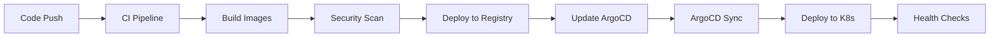

# 🚀 GitHub Actions CI/CD Workflows

This directory contains the complete CI/CD pipeline for the OpenTofu GitOps retail store platform.

## 📋 Workflow Overview

### 🏗️ Infrastructure Deployment (`infrastructure.yml`)
**Triggers:** Push to `gitops`/`main`, PR, Manual dispatch

**Features:**
- ✅ OpenTofu validation and security scanning
- 📋 Infrastructure planning with PR comments
- 🚀 Automated deployment to AWS EKS
- 💥 Infrastructure destruction (manual only)
- 🔒 Environment protection rules

**Jobs:**
1. **Validate** - Format check, validation, security scan with tfsec
2. **Plan** - Generate and comment infrastructure plan on PRs
3. **Apply** - Deploy infrastructure on push to gitops branch
4. **Destroy** - Destroy infrastructure (manual workflow dispatch only)

### 🚀 Application Deployment (`applications.yml`)
**Triggers:** Push to `gitops`, PR, Manual dispatch

**Features:**
- 🔍 Smart change detection for individual services
- ✅ Helm chart validation and linting
- 🛡️ Security scanning with Trivy
- 🔄 ArgoCD configuration deployment
- ⏳ Application health monitoring

**Jobs:**
1. **Detect Changes** - Identify which services changed
2. **Validate Helm** - Lint and validate Helm charts
3. **Validate ArgoCD** - Validate ArgoCD manifests
4. **Security Scan** - Vulnerability scanning
5. **Deploy ArgoCD Config** - Update ArgoCD applications
6. **Notify Deployment** - Status notifications

### 🔄 Continuous Integration (`ci.yml`)
**Triggers:** Push to any branch, PR

**Features:**
- 🔍 Code quality checks with Super-Linter
- 🧪 Multi-language testing (Java, Go, Node.js)
- 🐳 Container image building and pushing
- 🛡️ Container security scanning
- 🧪 Integration testing

**Jobs:**
1. **Code Quality** - Linting and code quality checks
2. **Test Services** - Unit tests for all services
3. **Build Images** - Build and push container images
4. **Security Scan Images** - Scan built images for vulnerabilities
5. **Integration Tests** - End-to-end testing
6. **Deployment Summary** - Pipeline status summary

## 🔧 Setup Instructions

### 1. Repository Secrets

Configure these secrets in your GitHub repository:

```bash
# AWS Credentials
AWS_ACCESS_KEY_ID=AKIA...
AWS_SECRET_ACCESS_KEY=...

# Optional: Container Registry (uses GITHUB_TOKEN by default)
REGISTRY_USERNAME=your-username
REGISTRY_PASSWORD=your-token
```

### 2. Environment Configuration

Create environments in GitHub repository settings:
- `dev` - Development environment
- `staging` - Staging environment  
- `prod` - Production environment

**Environment Protection Rules:**
- Require reviewers for production deployments
- Restrict deployments to specific branches
- Add deployment delays for production

### 3. Branch Protection

Configure branch protection for `gitops` branch:
- Require status checks to pass
- Require up-to-date branches
- Require review from code owners
- Restrict pushes to specific users/teams

## 🎯 Workflow Triggers

### Automatic Triggers

| Event | Infrastructure | Applications | CI |
|-------|---------------|--------------|-----|
| Push to `gitops` | ✅ Deploy | ✅ Deploy | ✅ Full CI |
| Push to other branches | ❌ | ❌ | ✅ CI Only |
| Pull Request | 📋 Plan Only | ✅ Validate | ✅ Full CI |

### Manual Triggers

**Infrastructure Workflow:**
```bash
# Plan infrastructure changes
gh workflow run infrastructure.yml -f action=plan -f environment=dev

# Apply infrastructure changes
gh workflow run infrastructure.yml -f action=apply -f environment=prod

# Destroy infrastructure (careful!)
gh workflow run infrastructure.yml -f action=destroy -f environment=dev
```

**Application Workflow:**
```bash
# Deploy specific service
gh workflow run applications.yml -f environment=staging -f service=ui

# Deploy all services
gh workflow run applications.yml -f environment=prod
```

## 📊 Monitoring & Notifications

### Status Checks
- All workflows provide detailed status in GitHub checks
- PR comments show infrastructure plans
- Deployment summaries in workflow runs
- Security scan results in Security tab

### Notifications
- Commit comments for deployment status
- PR comments for infrastructure changes
- Workflow summaries with deployment URLs
- Failed workflow notifications

## 🛡️ Security Features

### Code Security
- Super-Linter for code quality
- Trivy vulnerability scanning
- SARIF upload for security findings
- Dependency vulnerability checks

### Infrastructure Security
- tfsec security scanning for OpenTofu
- IAM least privilege principles
- Encrypted secrets management
- Environment-based access controls

### Container Security
- Multi-architecture builds (amd64, arm64)
- Vulnerability scanning of built images
- Signed container images
- Registry security scanning

## 🔄 GitOps Workflow

### Development Flow
1. **Feature Development** - Work on feature branch
2. **Pull Request** - Create PR to `gitops` branch
3. **CI Validation** - Automated testing and validation
4. **Code Review** - Team review and approval
5. **Merge to GitOps** - Triggers deployment pipeline
6. **ArgoCD Sync** - Applications automatically deploy
7. **Monitoring** - Health checks and monitoring

### Deployment Flow


## 🚨 Troubleshooting

### Common Issues

**Workflow fails with AWS permissions:**
```bash
# Check AWS credentials
aws sts get-caller-identity

# Verify IAM permissions
aws iam get-user
```

**OpenTofu state lock issues:**
```bash
# Force unlock (use carefully)
tofu force-unlock LOCK_ID
```

**ArgoCD sync failures:**
```bash
# Check application status
kubectl get applications -n argocd

# Manual sync
kubectl patch application APP_NAME -n argocd --type merge -p '{"operation":{"sync":{}}}'
```

### Debug Commands

```bash
# View workflow logs
gh run list --workflow=infrastructure.yml
gh run view RUN_ID --log

# Check deployment status
kubectl get pods -A
kubectl get applications -n argocd

# View ArgoCD logs
kubectl logs -f deployment/argocd-server -n argocd
```

## 📚 Additional Resources

- [OpenTofu Documentation](https://opentofu.org/docs/)
- [ArgoCD Documentation](https://argo-cd.readthedocs.io/)
- [GitHub Actions Documentation](https://docs.github.com/en/actions)
- [AWS EKS Documentation](https://docs.aws.amazon.com/eks/)
- [Kubernetes Documentation](https://kubernetes.io/docs/)