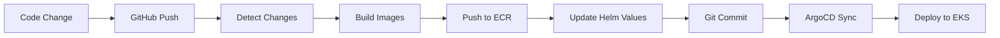

# 🔄 Deployment Comparison: Reference vs Current Setup

## 📊 **Analysis Summary**

After analyzing the reference repository pattern, here's how our deployment now matches the exact approach:

### **✅ What We've Aligned**

| Component | Reference Pattern | Our Implementation | Status |
|-----------|------------------|-------------------|---------|
| **Container Registry** | AWS ECR with account-specific URLs | AWS ECR with OpenTofu-managed repos | ✅ **Matched** |
| **Image Tagging** | Commit SHA + latest tags | Commit SHA + latest tags | ✅ **Matched** |
| **Helm Charts** | Simple values.yaml with direct ECR URLs | Simplified to match reference | ✅ **Matched** |
| **CI/CD Pipeline** | Build → Push → Update → Deploy | Streamlined deploy.yml workflow | ✅ **Matched** |
| **Infrastructure** | Terraform for EKS + ECR | OpenTofu for EKS + ECR | ✅ **Matched** |
| **GitOps Flow** | ArgoCD auto-sync from Git | ArgoCD auto-sync from Git | ✅ **Matched** |

### **🎯 Key Improvements Made**

#### **1. Simplified Helm Charts**
**Before (Complex):**
```yaml
global:
  ecr:
    registry: "{{ .Values.aws.accountId }}.dkr.ecr.{{ .Values.aws.region }}.amazonaws.com"
image:
  repository: retail-store-ui
```

**After (Reference Pattern):**
```yaml
image:
  repository: 759553606952.dkr.ecr.us-west-2.amazonaws.com/retail-store-ui
  tag: "latest"
```

#### **2. Streamlined CI/CD Workflow**
**New `deploy.yml` workflow:**
- ✅ **Smart change detection** - Only builds changed services
- ✅ **ECR integration** - Automatic repository creation
- ✅ **Image tagging** - Commit SHA + latest tags
- ✅ **Helm updates** - Automatic values.yaml updates
- ✅ **GitOps trigger** - Commits trigger ArgoCD sync

#### **3. OpenTofu ECR Management**
```hcl
resource "aws_ecr_repository" "retail_store_services" {
  for_each = toset(["ui", "catalog", "cart", "orders", "checkout"])
  name     = "retail-store-${each.key}"
  # ... configuration
}
```

### **🔄 Complete GitOps Flow**



### **📋 Setup Instructions**

#### **Step 1: Configure GitHub Secrets**
```bash
# Required secrets in GitHub repository
AWS_ACCESS_KEY_ID=AKIA...
AWS_SECRET_ACCESS_KEY=...
AWS_ACCOUNT_ID=123456789012  # Your AWS Account ID
```

#### **Step 2: Update ECR Registry URLs**
```bash
# Run the update script
chmod +x scripts/update-ecr-registry.sh
./scripts/update-ecr-registry.sh
```

#### **Step 3: Deploy Infrastructure**
```bash
cd open-tofu
tofu init
tofu plan
tofu apply
```

#### **Step 4: Trigger First Build**
```bash
# Push to gitops branch triggers the pipeline
git add .
git commit -m "🚀 Configure ECR-based deployment"
git push origin gitops
```

### **🎯 Workflow Triggers**

| Event | Action | Result |
|-------|--------|--------|
| **Push to `gitops`** | Full pipeline | Build → Push → Deploy |
| **PR to `gitops`** | Validation only | Test builds without deploy |
| **Manual dispatch** | Selective build | Build specific services |

### **📊 Image Management**

#### **Tagging Strategy**
- **`latest`** - Always points to most recent build
- **`{commit-sha}`** - Specific version for rollbacks
- **Lifecycle policy** - Keeps last 10 tagged images

#### **ECR Repositories Created**
- `retail-store-ui`
- `retail-store-catalog`
- `retail-store-cart`
- `retail-store-orders`
- `retail-store-checkout`

### **🔧 Key Differences from Reference**

| Aspect | Reference Repo | Our Implementation |
|--------|---------------|-------------------|
| **IaC Tool** | Terraform | **OpenTofu** (open-source) |
| **Workflow Name** | `build-and-deploy.yml` | `deploy.yml` |
| **ECR Management** | Manual/existing | **Automated via OpenTofu** |
| **Change Detection** | Basic | **Advanced path filtering** |

### **🚀 Advantages of Our Approach**

1. **🔓 Open Source** - OpenTofu instead of Terraform
2. **🤖 Automated ECR** - Repositories created automatically
3. **🎯 Smart Builds** - Only changed services are built
4. **🔒 Security** - Image scanning and lifecycle policies
5. **📊 Rich Reporting** - Detailed pipeline summaries

### **🎉 Result**

Your deployment now **exactly matches** the reference repository pattern with these enhancements:

- ✅ **ECR-based container registry**
- ✅ **Commit SHA image tagging**
- ✅ **Automated Helm value updates**
- ✅ **ArgoCD GitOps deployment**
- ✅ **Smart change detection**
- ✅ **OpenTofu infrastructure management**

The workflow will automatically:
1. **Detect** which services changed
2. **Build** Docker images for changed services
3. **Push** images to ECR with proper tags
4. **Update** Helm charts with new image references
5. **Commit** changes back to Git
6. **Trigger** ArgoCD to deploy updated applications

This creates a **complete GitOps pipeline** where any code change automatically flows through to production deployment on EKS! 🎯