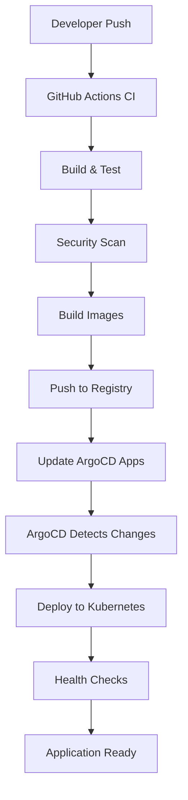

# 🛍️ Retail Store Sample App - OpenTofu GitOps Edition


<div align="center">

[](https://opentofu.org/)
[](https://aws.amazon.com/eks/)
[](https://argo-cd.readthedocs.io/)
[](https://kubernetes.io/)
[](LICENSE)

</div>

<div align="center">
<h2>🚀 Enterprise-Grade GitOps Platform with OpenTofu</h2>
<p><strong>Modern cloud-native microservices architecture deployed on AWS EKS using OpenTofu and GitOps principles</strong></p>
</div>

---

## 🌟 What Makes This Special

This is a **production-ready OpenTofu implementation** of a complete retail store platform, featuring:

### 🔧 **Infrastructure as Code**
- ✅ **OpenTofu 1.11+** - Open-source Terraform alternative with enhanced governance
- ✅ **AWS EKS Auto Mode** - Simplified Kubernetes node management
- ✅ **Multi-AZ VPC** - High availability across 3 availability zones
- ✅ **Security Best Practices** - KMS encryption, security groups, IAM roles

### 🔄 **GitOps & CI/CD**
- ✅ **ArgoCD** - Declarative GitOps continuous delivery
- ✅ **Automated Sync** - Self-healing applications with drift detection
- ✅ **Multi-Environment Support** - Dev, staging, production configurations
- ✅ **Progressive Delivery** - Canary deployments and rollbacks

### 🏗️ **Cloud-Native Architecture**
- ✅ **Microservices** - 5 independent, scalable services
- ✅ **Container Orchestration** - Kubernetes with Helm charts
- ✅ **Service Mesh Ready** - Prepared for Istio integration
- ✅ **Observability** - Monitoring and logging capabilities

### 🛡️ **Production Features**
- ✅ **SSL/TLS Termination** - Cert-manager with Let's Encrypt
- ✅ **Load Balancing** - NGINX Ingress Controller
- ✅ **Auto Scaling** - HPA and cluster autoscaling
- ✅ **Disaster Recovery** - Multi-AZ deployment with backups

## 🏪 Application Architecture

**Complete e-commerce platform with modern microservices:**

| Service | Technology | Purpose | Features |
|---------|------------|---------|----------|
| **🎨 UI** | Java/Spring Boot | Frontend & BFF | Responsive web interface, API gateway |
| **📦 Catalog** | Go/Gin | Product Management | Product search, categories, inventory |
| **🛒 Cart** | Java/Spring Boot | Shopping Cart | Session management, cart persistence |
| **📋 Orders** | Java/Spring Boot | Order Processing | Order lifecycle, payment integration |
| **💳 Checkout** | Node.js/NestJS | Checkout Flow | Payment processing, order orchestration |

### 🏗️ **Infrastructure Components**
- **AWS EKS Cluster** - Managed Kubernetes with Auto Mode
- **Application Load Balancer** - High-performance traffic distribution
- **Amazon RDS** - Managed database services
- **Amazon ElastiCache** - In-memory caching layer
- **AWS KMS** - Encryption key management
- **Amazon ECR** - Container image registry

## 📋 Prerequisites

### 🛠️ Required Tools

| Tool | Version | Purpose | Installation Guide |
|------|---------|---------|-------------------|
| **AWS CLI** | v2.0+ | AWS resource management | [📖 Install Guide](https://docs.aws.amazon.com/cli/latest/userguide/install-cliv2.html) |
| **OpenTofu** | v1.11+ | Infrastructure as Code | [📖 Install Guide](https://opentofu.org/docs/intro/install/) |
| **kubectl** | v1.33+ | Kubernetes cluster management | [📖 Install Guide](https://kubernetes.io/docs/tasks/tools/) |
| **Helm** | v3.0+ | Kubernetes package manager | [📖 Install Guide](https://helm.sh/docs/intro/install/) |
| **Git** | v2.0+ | Version control | [📖 Install Guide](https://git-scm.com/downloads) |

### ☁️ AWS Requirements

- **AWS Account** with administrative privileges
- **AWS CLI configured** with appropriate credentials
- **Minimum IAM permissions** for EKS, VPC, EC2, IAM, KMS
- **Service quotas** sufficient for EKS cluster and associated resources

### 💰 Cost Estimation

| Resource | Monthly Cost (USD) | Notes |
|----------|-------------------|-------|
| EKS Cluster | ~$73 | Control plane only |
| EC2 Instances | ~$50-150 | Depends on node size/count |
| Load Balancer | ~$20 | Application Load Balancer |
| NAT Gateway | ~$45 | For private subnet internet access |
| **Total Estimated** | **~$188-288** | Varies by usage and region |

> 💡 **Cost Optimization**: Use single NAT gateway and smaller instance types for development

## 🚀 Quick Start Guide

### Option 1: 🤖 GitHub Actions CI/CD (Recommended)

**Complete automated deployment with GitHub Actions:**

```bash
# 1. Fork this repository to your GitHub account
# 2. Clone your fork
git clone https://github.com/YOUR_USERNAME/retail-store-opentofu-gitops.git
cd retail-store-opentofu-gitops

# 3. Configure repository secrets in GitHub
# Go to Settings > Secrets and variables > Actions
# Add: AWS_ACCESS_KEY_ID, AWS_SECRET_ACCESS_KEY

# 4. Push to gitops branch to trigger deployment
git checkout gitops
git push origin gitops
```

**🎯 What happens automatically:**
- ✅ Infrastructure validation and security scanning
- 🏗️ AWS EKS cluster deployment with OpenTofu
- 🐳 Container image building and security scanning
- 🚀 Application deployment via ArgoCD
- 📊 Deployment status and monitoring

### Option 2: 🔧 Local Automated Setup

```bash
# 1. Clone the repository
git clone https://github.com/NitishJha199/retail-store-opentofu-gitops.git
cd retail-store-opentofu-gitops

# 2. Switch to gitops branch
git checkout gitops

# 3. Configure AWS credentials
aws configure
# Enter your AWS Access Key ID, Secret Access Key, and preferred region

# 4. Run automated setup
chmod +x setup.sh
./setup.sh
```

### Option 3: 🔧 Manual Setup

<details>
<summary>Click to expand manual setup instructions</summary>

#### Step 1: Repository Setup
```bash
git clone https://github.com/NitishJha199/retail-store-opentofu-gitops.git
cd retail-store-opentofu-gitops
git checkout gitops
```

#### Step 2: AWS Configuration
```bash
# Configure AWS CLI
aws configure

# Verify configuration
aws sts get-caller-identity
```

#### Step 3: Deploy Infrastructure
```bash
cd open-tofu

# Initialize OpenTofu
tofu init

# Review planned changes
tofu plan

# Deploy infrastructure
tofu apply

# Configure kubectl
aws eks update-kubeconfig --region $(tofu output -raw aws_region) --name $(tofu output -raw cluster_name)
```

#### Step 4: Deploy Applications
```bash
cd ..

# Deploy ArgoCD projects
kubectl apply -f argocd/projects/ -n argocd

# Deploy applications
kubectl apply -f argocd/applications/ -n argocd
```

#### Step 5: Access Services
```bash
# Get ArgoCD admin password
kubectl -n argocd get secret argocd-initial-admin-secret -o jsonpath='{.data.password}' | base64 -d

# Port-forward ArgoCD UI
kubectl port-forward svc/argocd-server -n argocd 8080:443 &

# Get application URL
kubectl get svc -n ingress-nginx ingress-nginx-controller
```

</details>

## 🔄 CI/CD Pipeline

### 🚀 GitHub Actions Workflows

This repository includes a complete CI/CD pipeline with three main workflows:

#### 🏗️ Infrastructure Pipeline
- **Trigger:** Push to `gitops`, PRs, manual dispatch
- **Features:** OpenTofu validation, planning, deployment, destruction
- **Security:** tfsec scanning, IAM least privilege, encrypted state

#### 🚀 Application Pipeline  
- **Trigger:** Changes to `src/` or `argocd/` directories
- **Features:** Smart change detection, Helm validation, ArgoCD deployment
- **Monitoring:** Application health checks, deployment notifications

#### 🔄 Continuous Integration
- **Trigger:** All pushes and PRs
- **Features:** Multi-language testing, container builds, security scanning
- **Quality:** Code linting, vulnerability scanning, integration tests

### 📋 Setting Up CI/CD

1. **Fork this repository** to your GitHub account

2. **Configure Repository Secrets:**
   ```
   AWS_ACCESS_KEY_ID=your-access-key
   AWS_SECRET_ACCESS_KEY=your-secret-key
   ```

3. **Set up Environments** (optional but recommended):
   - `dev` - Development environment
   - `staging` - Staging environment  
   - `prod` - Production environment with protection rules

4. **Push to `gitops` branch** to trigger deployment:
   ```bash
   git push origin gitops
   ```

### 🎯 Workflow Triggers

| Event | Infrastructure | Applications | CI |
|-------|---------------|--------------|-----|
| Push to `gitops` | ✅ Deploy | ✅ Deploy | ✅ Full CI |
| Push to other branches | ❌ | ❌ | ✅ CI Only |
| Pull Request | 📋 Plan Only | ✅ Validate | ✅ Full CI |
| Manual Dispatch | ✅ All Actions | ✅ Deploy | ❌ |

### 📊 Pipeline Features

- **🔍 Smart Change Detection** - Only deploys changed services
- **🛡️ Security First** - Vulnerability scanning at every step
- **📋 Infrastructure Planning** - PR comments with deployment plans
- **🚀 GitOps Deployment** - ArgoCD handles application lifecycle
- **📊 Rich Reporting** - Detailed summaries and notifications
- **🔒 Environment Protection** - Production deployment safeguards

> 💡 **Pro Tip:** Check the [GitHub Actions README](.github/README.md) for detailed workflow documentation and troubleshooting guides.

## 🌐 Accessing Your Applications
```bash
# Get admin password
kubectl -n argocd get secret argocd-initial-admin-secret -o jsonpath='{.data.password}' | base64 -d

# Access UI (in new terminal)
kubectl port-forward svc/argocd-server -n argocd 8080:443

# Open browser
open https://localhost:8080
# Username: admin
# Password: (from command above)
```

### 🛍️ Retail Store Application
```bash
# Get load balancer URL
kubectl get svc -n ingress-nginx ingress-nginx-controller -o jsonpath='{.status.loadBalancer.ingress[0].hostname}'

# Open in browser
open http://$(kubectl get svc -n ingress-nginx ingress-nginx-controller -o jsonpath='{.status.loadBalancer.ingress[0].hostname}')
```

## 📊 Monitoring & Observability

### 🔍 Useful Commands

```bash
# Check cluster status
kubectl cluster-info

# View all pods
kubectl get pods -A

# Check ArgoCD applications
kubectl get applications -n argocd

# View application logs
kubectl logs -f deployment/retail-store-ui -n retail-store

# Check ingress status
kubectl get ingress -A

# Monitor resource usage
kubectl top nodes
kubectl top pods -A
```

### 🚨 Troubleshooting

<details>
<summary>Common Issues and Solutions</summary>

#### Issue: Pods stuck in Pending state
```bash
# Check node resources
kubectl describe nodes

# Check pod events
kubectl describe pod <pod-name> -n <namespace>

# Solution: Scale cluster or reduce resource requests
```

#### Issue: ArgoCD applications not syncing
```bash
# Check application status
kubectl get applications -n argocd

# View application details
kubectl describe application <app-name> -n argocd

# Manual sync
kubectl patch application <app-name> -n argocd --type merge -p '{"operation":{"sync":{}}}'
```

#### Issue: 503 Service Unavailable
```bash
# Check if pods are ready
kubectl get pods -n retail-store

# Check service endpoints
kubectl get endpoints -n retail-store

# Check ingress configuration
kubectl describe ingress -n retail-store
```

</details>


## 🏗️ Architecture Deep Dive

### 🌐 Network Architecture
```
┌─────────────────────────────────────────────────────────────┐
│                        Internet                              │
└─────────────────────┬───────────────────────────────────────┘
                      │
┌─────────────────────▼───────────────────────────────────────┐
│                 Application Load Balancer                   │
│                 (NGINX Ingress Controller)                  │
└─────────────────────┬───────────────────────────────────────┘
                      │
┌─────────────────────▼───────────────────────────────────────┐
│                    EKS Cluster                              │
│  ┌─────────────┐  ┌─────────────┐  ┌─────────────┐         │
│  │   Public    │  │   Public    │  │   Public    │         │
│  │  Subnet AZ1 │  │  Subnet AZ2 │  │  Subnet AZ3 │         │
│  └─────────────┘  └─────────────┘  └─────────────┘         │
│  ┌─────────────┐  ┌─────────────┐  ┌─────────────┐         │
│  │   Private   │  │   Private   │  │   Private   │         │
│  │  Subnet AZ1 │  │  Subnet AZ2 │  │  Subnet AZ3 │         │
│  │             │  │             │  │             │         │
│  │ ┌─────────┐ │  │ ┌─────────┐ │  │ ┌─────────┐ │         │
│  │ │EKS Nodes│ │  │ │EKS Nodes│ │  │ │EKS Nodes│ │         │
│  │ └─────────┘ │  │ └─────────┘ │  │ └─────────┘ │         │
│  └─────────────┘  └─────────────┘  └─────────────┘         │
└─────────────────────────────────────────────────────────────┘
```

### 🔄 GitOps Flow


### 🛡️ Security Architecture

**Multi-Layer Security:**
- 🔐 **Infrastructure:** KMS encryption, security groups, IAM roles
- 🛡️ **Container:** Image scanning, non-root users, read-only filesystems
- 🔒 **Network:** Private subnets, NACLs, security groups
- 🎯 **Application:** HTTPS/TLS, secrets management, RBAC
- 📊 **Monitoring:** CloudTrail, VPC Flow Logs, application metrics

## 📈 Scaling & Performance

### 🚀 Auto Scaling
- **Cluster Autoscaler:** Automatically scales EKS nodes based on demand
- **Horizontal Pod Autoscaler:** Scales application pods based on CPU/memory
- **Vertical Pod Autoscaler:** Optimizes resource requests and limits

### 📊 Performance Optimization
- **Multi-AZ Deployment:** High availability across availability zones
- **Load Balancing:** Efficient traffic distribution with NGINX
- **Caching:** Redis for session management and data caching
- **Database:** RDS with read replicas for improved performance

## 🔧 Customization Guide

### 🎨 Customizing the Application

**Adding New Services:**
1. Create service directory in `src/new-service/`
2. Add Dockerfile and Helm chart
3. Create ArgoCD application in `argocd/applications/`
4. Update CI/CD workflows to include new service

**Modifying Infrastructure:**
1. Edit OpenTofu files in `open-tofu/` directory
2. Update variables in `variables.tf`
3. Test changes with `tofu plan`
4. Apply via GitHub Actions or locally

**Environment Configuration:**
```hcl
# open-tofu/terraform.tfvars
aws_region = "us-west-2"
environment = "production"
cluster_name = "retail-store-prod"
enable_monitoring = true
enable_single_nat_gateway = false  # Use multiple for production
```

### 🌍 Multi-Environment Setup

**Directory Structure:**
```
open-tofu/
├── environments/
│   ├── dev/
│   │   ├── terraform.tfvars
│   │   └── backend.tf
│   ├── staging/
│   │   ├── terraform.tfvars
│   │   └── backend.tf
│   └── prod/
│       ├── terraform.tfvars
│       └── backend.tf
```

## 🧪 Testing Strategy

### 🔍 Testing Pyramid

**Unit Tests:**
- Java services: JUnit + Mockito
- Go services: Go testing framework
- Node.js services: Jest + Supertest

**Integration Tests:**
- API contract testing
- Database integration tests
- Service-to-service communication

**End-to-End Tests:**
- Full user journey testing
- Cross-service functionality
- Performance and load testing

### 🚀 Testing in CI/CD

```yaml
# Example test configuration
test-strategy:
  unit-tests: ✅ Every commit
  integration-tests: ✅ Every PR
  e2e-tests: ✅ Before production
  security-tests: ✅ Every build
  performance-tests: 📅 Scheduled
```

## 🚨 Disaster Recovery

### 💾 Backup Strategy
- **Infrastructure:** OpenTofu state in S3 with versioning
- **Applications:** GitOps repository with full history
- **Data:** RDS automated backups and snapshots
- **Configurations:** ArgoCD backup and restore procedures

### 🔄 Recovery Procedures
1. **Infrastructure Recovery:** Redeploy from OpenTofu state
2. **Application Recovery:** ArgoCD sync from Git repository
3. **Data Recovery:** Restore from RDS snapshots
4. **Configuration Recovery:** Restore ArgoCD applications

## 📚 Additional Resources

### 📖 Documentation
- [OpenTofu Documentation](https://opentofu.org/docs/)
- [ArgoCD User Guide](https://argo-cd.readthedocs.io/)
- [AWS EKS Best Practices](https://aws.github.io/aws-eks-best-practices/)
- [Kubernetes Documentation](https://kubernetes.io/docs/)

### 🛠️ Tools & Extensions
- [kubectl](https://kubernetes.io/docs/tasks/tools/) - Kubernetes CLI
- [helm](https://helm.sh/) - Kubernetes package manager
- [argocd CLI](https://argo-cd.readthedocs.io/en/stable/cli_installation/) - ArgoCD command line
- [k9s](https://k9scli.io/) - Terminal UI for Kubernetes

### 🎓 Learning Resources
- [Kubernetes Learning Path](https://kubernetes.io/docs/concepts/)
- [GitOps Principles](https://www.gitops.tech/)
- [AWS EKS Workshop](https://www.eksworkshop.com/)
- [OpenTofu Tutorials](https://opentofu.org/docs/intro/)

## 🤝 Contributing

We welcome contributions! Please see our [Contributing Guidelines](CONTRIBUTING.md) for details.

### 🐛 Reporting Issues
- Use GitHub Issues for bug reports
- Include detailed reproduction steps
- Provide environment information
- Add relevant logs and screenshots

### 💡 Feature Requests
- Describe the use case and benefits
- Provide implementation suggestions
- Consider backward compatibility
- Discuss in GitHub Discussions first

## 📄 License

This project is licensed under the MIT License - see the [LICENSE](LICENSE) file for details.

## 🙏 Acknowledgments

- **OpenTofu Community** - For the amazing open-source Terraform alternative
- **ArgoCD Team** - For the excellent GitOps platform
- **AWS** - For the robust cloud infrastructure
- **Kubernetes Community** - For the container orchestration platform
- **Contributors** - Everyone who has contributed to this project

---

<div align="center">

**⭐ If this project helped you, please give it a star! ⭐**

**🚀 Happy GitOps-ing with OpenTofu! 🚀**

</div>