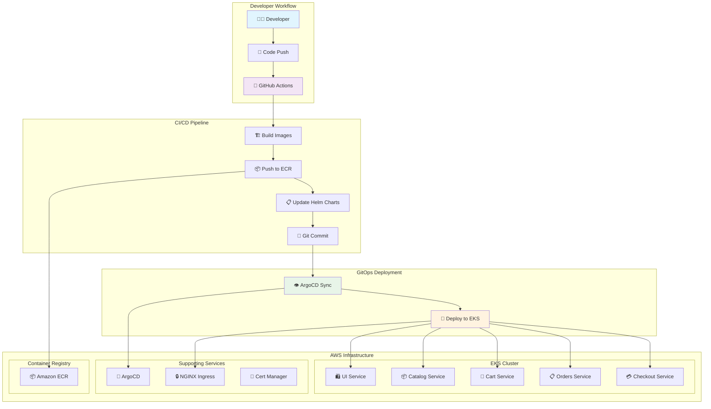
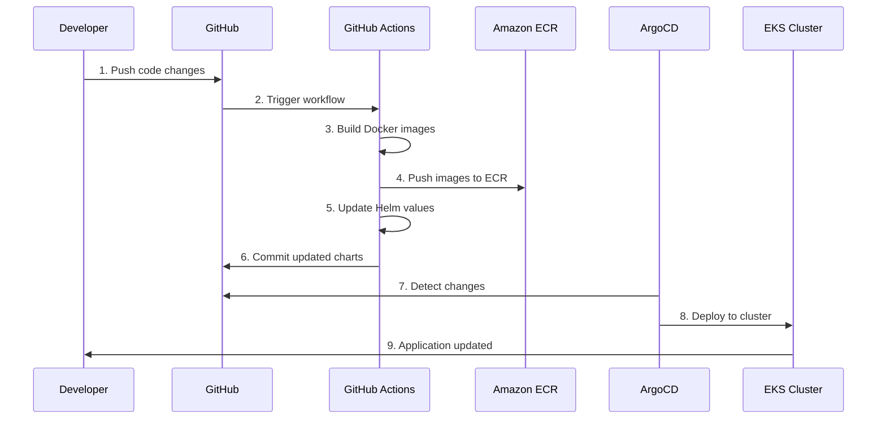

# 🛍️ Retail Store - GitOps with OpenTofu & ArgoCD

[](https://opensource.org/licenses/MIT)
[](https://opentofu.org/)
[](https://kubernetes.io/)
[](https://argo-cd.readthedocs.io/)
[](https://aws.amazon.com/eks/)

A complete **GitOps-enabled microservices retail application** deployed on AWS EKS using OpenTofu (Terraform), ArgoCD, and ECR. This project demonstrates modern cloud-native deployment practices with Infrastructure as Code (IaC) and continuous deployment.

## 📚 Table of Contents

- [🏗️ Architecture Overview](#️-architecture-overview)
- [🌟 Features](#-features)
- [🛠️ Technology Stack](#️-technology-stack)
- [🏪 Application Services](#-application-services)
- [📋 Prerequisites](#-prerequisites)
- [🚀 Quick Start](#-quick-start)
- [📖 Detailed Deployment Guide](#-detailed-deployment-guide)
- [🔄 GitOps Workflow](#-gitops-workflow)
- [🔧 Configuration](#-configuration)
- [🔍 Monitoring and Troubleshooting](#-monitoring-and-troubleshooting)
- [🧪 Testing](#-testing)
- [🔒 Security Considerations](#-security-considerations)
- [📊 Cost Optimization](#-cost-optimization)
- [🚀 Advanced Features](#-advanced-features)
- [🤝 Contributing](#-contributing)
- [📚 Additional Resources](#-additional-resources)
- [🆘 Support](#-support)
- [📄 License](#-license)
- [🙏 Acknowledgments](#-acknowledgments)

## 🏗️ Architecture Overview



## 🌟 Features

- **🔄 Complete GitOps Workflow**: Automated CI/CD with GitHub Actions and ArgoCD
- **☁️ Cloud-Native Architecture**: Microservices deployed on AWS EKS
- **🏗️ Infrastructure as Code**: OpenTofu for reproducible infrastructure
- **📦 Container Registry**: Amazon ECR for secure image storage
- **🔒 Security**: RBAC, network policies, and encrypted storage
- **📊 Observability**: Prometheus metrics and health checks
- **🌐 Ingress**: NGINX with SSL/TLS termination
- **📜 Certificate Management**: Automated SSL certificates with cert-manager

## 🛠️ Technology Stack

| Component | Technology | Purpose |
|-----------|------------|---------|
| **Infrastructure** | OpenTofu | Infrastructure as Code |
| **Container Orchestration** | Amazon EKS | Kubernetes cluster management |
| **Container Registry** | Amazon ECR | Docker image storage |
| **GitOps** | ArgoCD | Continuous deployment |
| **CI/CD** | GitHub Actions | Build and deployment automation |
| **Ingress** | NGINX Ingress Controller | Load balancing and routing |
| **Certificates** | cert-manager | SSL/TLS certificate management |
| **Package Management** | Helm | Kubernetes application packaging |

## 🏪 Application Services

The retail store consists of 5 microservices:

| Service | Language | Port | Description |
|---------|----------|------|-------------|
| **UI** | Java (Spring Boot) | 8080 | Frontend web interface |
| **Catalog** | Go | 8080 | Product catalog management |
| **Cart** | Java (Spring Boot) | 8080 | Shopping cart functionality |
| **Orders** | Java (Spring Boot) | 8080 | Order processing |
| **Checkout** | Node.js | 8080 | Payment processing |

## 📋 Prerequisites

Before you begin, ensure you have the following installed and configured:

### Required Tools

| Tool | Version | Purpose | Installation Guide |
|------|---------|---------|-------------------|
| **AWS CLI** | v2.0+ | AWS service management | [Install AWS CLI](https://docs.aws.amazon.com/cli/latest/userguide/getting-started-install.html) |
| **OpenTofu** | v1.6+ | Infrastructure as Code | [Install OpenTofu](https://opentofu.org/docs/intro/install/) |
| **kubectl** | v1.28+ | Kubernetes management | [Install kubectl](https://kubernetes.io/docs/tasks/tools/) |
| **Docker** | v20.0+ | Container management | [Install Docker](https://docs.docker.com/get-docker/) |
| **Git** | Latest | Version control | [Install Git](https://git-scm.com/book/en/v2/Getting-Started-Installing-Git) |

### AWS Requirements
- ✅ **AWS Account** with appropriate permissions
- ✅ **AWS CLI configured** with credentials (`aws configure`)
- ✅ **IAM Permissions** for EKS, ECR, VPC, IAM, and related services
- ✅ **Service Quotas** sufficient for EKS cluster and resources

### Quick Installation (Ubuntu/Debian)
```bash
# Install all required tools
curl -fsSL https://get.docker.com -o get-docker.sh && sh get-docker.sh
curl -LO "https://dl.k8s.io/release/$(curl -L -s https://dl.k8s.io/release/stable.txt)/bin/linux/amd64/kubectl"
sudo install -o root -g root -m 0755 kubectl /usr/local/bin/kubectl
curl -fsSL https://releases.hashicorp.com/terraform/1.6.0/terraform_1.6.0_linux_amd64.zip -o terraform.zip
unzip terraform.zip && sudo mv terraform /usr/local/bin/tofu
pip3 install awscli
```

### Verification Commands
```bash
# Verify all installations
echo "🔍 Verifying installations..."
aws --version && echo "✅ AWS CLI installed"
tofu --version && echo "✅ OpenTofu installed"
kubectl version --client && echo "✅ kubectl installed"
docker --version && echo "✅ Docker installed"
git --version && echo "✅ Git installed"

# Verify AWS configuration
aws sts get-caller-identity && echo "✅ AWS credentials configured"
```

## 🚀 Quick Start

### 🎯 One-Command Deployment

For the fastest setup, use our automated deployment script:

```bash
# 🚀 Complete automated deployment
git clone https://github.com/NitishJha199/retail-store-opentofu-gitops.git
cd retail-store-opentofu-gitops
chmod +x quick-start.sh
./quick-start.sh

# Or step-by-step deployment
chmod +x deploy-modules.sh scripts/build-and-push-images.sh
./deploy-modules.sh && ./scripts/build-and-push-images.sh
```

> 💡 **Pro Tip**: The `quick-start.sh` script includes interactive prompts, prerequisite checks, and comprehensive deployment verification!

### 📝 Step-by-Step Deployment

#### 1. Clone the Repository
```bash
git clone https://github.com/NitishJha199/retail-store-opentofu-gitops.git
cd retail-store-opentofu-gitops
```

#### 2. Configure AWS Credentials
```bash
aws configure
# Enter your AWS Access Key ID, Secret Access Key, and region (us-west-2 recommended)

# Verify configuration
aws sts get-caller-identity
```

#### 3. Deploy Infrastructure (5-10 minutes)
```bash
# Make deployment script executable
chmod +x deploy-modules.sh

# Deploy infrastructure step by step
./deploy-modules.sh

# Expected output:
# ✅ VPC and networking deployed
# ✅ ECR repositories created  
# ✅ EKS cluster deployed
# ✅ Add-ons installed
# ✅ ArgoCD deployed
```

#### 4. Build and Push Container Images (10-15 minutes)
```bash
# Make build script executable
chmod +x scripts/build-and-push-images.sh

# Build and push all service images to ECR
./scripts/build-and-push-images.sh

# Expected output:
# ✅ UI service image built and pushed
# ✅ Catalog service image built and pushed
# ✅ Cart service image built and pushed
# ✅ Orders service image built and pushed
# ✅ Checkout service image built and pushed
```

#### 5. Access ArgoCD Dashboard
```bash
# Get ArgoCD admin password
ARGOCD_PASSWORD=$(kubectl -n argocd get secret argocd-initial-admin-secret -o jsonpath="{.data.password}" | base64 -d)
echo "🔑 ArgoCD Admin Password: $ARGOCD_PASSWORD"

# Port forward to access ArgoCD UI (run in separate terminal)
kubectl port-forward svc/argocd-server -n argocd 8080:443

# 🌐 Open browser to https://localhost:8080
# Username: admin
# Password: (from step above)
```

#### 6. Access the Retail Store Application
```bash
# Get the load balancer URL
LB_URL=$(kubectl get ingress retail-store-ui-direct -n retail-store -o jsonpath='{.status.loadBalancer.ingress[0].hostname}')
echo "🛍️ Application URL: http://$LB_URL"

# Test the application
curl -s -o /dev/null -w "%{http_code}" http://$LB_URL
# Expected: 200

# 🌐 Open browser to http://$LB_URL
```

### 🎉 Success Indicators

After successful deployment, you should see:

```bash
# ✅ All pods running
$ kubectl get pods -n retail-store
NAME                                      READY   STATUS    RESTARTS   AGE
retail-store-cart-carts-xxx               1/1     Running   0          5m
retail-store-catalog-xxx                  1/1     Running   0          5m
retail-store-checkout-xxx                 1/1     Running   0          5m
retail-store-orders-xxx                   1/1     Running   0          5m
retail-store-ui-xxx                       1/1     Running   0          5m

# ✅ ArgoCD applications synced
$ kubectl get applications -n argocd
NAME                    SYNC STATUS   HEALTH STATUS
retail-store-cart       Synced        Healthy
retail-store-catalog    Synced        Healthy
retail-store-checkout   Synced        Healthy
retail-store-orders     Synced        Healthy
retail-store-ui         Synced        Healthy

# ✅ Application responding
$ curl -I http://$LB_URL
HTTP/1.1 200 OK
```

### 🔍 Verify Your Deployment

Run our comprehensive verification script:

```bash
# Check everything is working correctly
./verify-setup.sh

# Expected output:
# ✅ PASS Connected to cluster
# ✅ PASS All nodes are ready  
# ✅ PASS All namespaces exist
# ✅ PASS All application pods running
# ✅ PASS All ArgoCD applications healthy
# ✅ PASS Load balancer accessible
# ✅ PASS All ECR images available
# 🎉 All checks passed! Your deployment is ready to use.
```

## 📖 Detailed Deployment Guide

### Step 1: Infrastructure Deployment

The infrastructure is deployed in phases for better control and debugging:

#### Phase 1: VPC and Networking
```bash
cd open-tofu
tofu init
tofu plan -target="module.vpc"
tofu apply -target="module.vpc" -auto-approve
```

#### Phase 2: ECR Repositories
```bash
tofu plan -target="aws_ecr_repository.retail_store_services"
tofu apply -target="aws_ecr_repository.retail_store_services" -auto-approve
```

#### Phase 3: EKS Cluster
```bash
tofu plan -target="module.eks"
tofu apply -target="module.eks" -auto-approve
```

#### Phase 4: EKS Add-ons
```bash
tofu plan -target="module.eks_addons"
tofu apply -target="module.eks_addons" -auto-approve
```

#### Phase 5: ArgoCD
```bash
tofu apply -auto-approve
```

### Step 2: Configure kubectl
```bash
# Update kubeconfig
aws eks update-kubeconfig --region us-west-2 --name $(tofu output -raw cluster_name)

# Verify connection
kubectl get nodes
```

### Step 3: Container Images

#### Build Individual Services
```bash
# UI Service
docker build -t $(aws sts get-caller-identity --query Account --output text).dkr.ecr.us-west-2.amazonaws.com/retail-store-ui:latest ./src/ui/

# Catalog Service
docker build -t $(aws sts get-caller-identity --query Account --output text).dkr.ecr.us-west-2.amazonaws.com/retail-store-catalog:latest ./src/catalog/

# Cart Service
docker build -t $(aws sts get-caller-identity --query Account --output text).dkr.ecr.us-west-2.amazonaws.com/retail-store-cart:latest ./src/cart/

# Orders Service
docker build -t $(aws sts get-caller-identity --query Account --output text).dkr.ecr.us-west-2.amazonaws.com/retail-store-orders:latest ./src/orders/

# Checkout Service
docker build -t $(aws sts get-caller-identity --query Account --output text).dkr.ecr.us-west-2.amazonaws.com/retail-store-checkout:latest ./src/checkout/
```

#### Push to ECR
```bash
# Login to ECR
aws ecr get-login-password --region us-west-2 | docker login --username AWS --password-stdin $(aws sts get-caller-identity --query Account --output text).dkr.ecr.us-west-2.amazonaws.com

# Push all images
docker push $(aws sts get-caller-identity --query Account --output text).dkr.ecr.us-west-2.amazonaws.com/retail-store-ui:latest
docker push $(aws sts get-caller-identity --query Account --output text).dkr.ecr.us-west-2.amazonaws.com/retail-store-catalog:latest
docker push $(aws sts get-caller-identity --query Account --output text).dkr.ecr.us-west-2.amazonaws.com/retail-store-cart:latest
docker push $(aws sts get-caller-identity --query Account --output text).dkr.ecr.us-west-2.amazonaws.com/retail-store-orders:latest
docker push $(aws sts get-caller-identity --query Account --output text).dkr.ecr.us-west-2.amazonaws.com/retail-store-checkout:latest
```

## 🔄 GitOps Workflow

### Automated CI/CD Pipeline



### Manual Deployment Process

1. **Code Changes**: Make changes to application code
2. **Build Images**: Use the build script to create new container images
3. **Push to ECR**: Upload images to Amazon ECR
4. **Update Helm Charts**: Modify image tags in Helm values
5. **Commit Changes**: Push updated charts to Git
6. **ArgoCD Sync**: ArgoCD automatically deploys changes

## 🔧 Configuration

### Environment Variables

Key configuration files and their purposes:

| File | Purpose |
|------|---------|
| `open-tofu/variables.tf` | Infrastructure configuration |
| `src/*/chart/values.yaml` | Helm chart configurations |
| `.github/workflows/deploy.yml` | CI/CD pipeline configuration |
| `argocd/applications/*.yaml` | ArgoCD application definitions |

### Customization Options

#### Infrastructure Customization
```hcl
# open-tofu/terraform.tfvars
cluster_name = "your-cluster-name"
region = "us-west-2"
node_instance_types = ["t3.medium"]
```

#### Application Customization
```yaml
# src/ui/chart/values.yaml
replicaCount: 2
resources:
  limits:
    memory: 1Gi
  requests:
    cpu: 200m
    memory: 512Mi
```

## 🔍 Monitoring and Troubleshooting

### Health Checks
```bash
# Check cluster status
kubectl get nodes

# Check pod status
kubectl get pods -n retail-store

# Check ArgoCD applications
kubectl get applications -n argocd

# Check ingress
kubectl get ingress -n retail-store
```

### Common Issues and Solutions

#### Issue: Pods stuck in Pending state
```bash
# Check node taints
kubectl describe nodes

# Remove disruption taint if present
kubectl taint node <node-name> karpenter.sh/disrupted:NoSchedule-
```

#### Issue: Image pull errors
```bash
# Verify ECR repositories exist
aws ecr describe-repositories --region us-west-2

# Check if images are pushed
aws ecr list-images --repository-name retail-store-ui --region us-west-2
```

#### Issue: ArgoCD sync failures
```bash
# Check ArgoCD logs
kubectl logs -n argocd deployment/argocd-application-controller

# Refresh application
kubectl patch application retail-store-ui -n argocd -p '{"metadata":{"annotations":{"argocd.argoproj.io/refresh":"hard"}}}' --type merge
```

### Logs and Debugging
```bash
# Application logs
kubectl logs -f deployment/retail-store-ui -n retail-store

# ArgoCD logs
kubectl logs -f deployment/argocd-server -n argocd

# Ingress controller logs
kubectl logs -f deployment/ingress-nginx-controller -n ingress-nginx
```

## 🧪 Testing

### Automated Tests
```bash
# Run the test deployment script
chmod +x test-deployment.sh
./test-deployment.sh
```

### Manual Testing
```bash
# Test application endpoints
curl http://<load-balancer-url>/
curl http://<load-balancer-url>/catalogue
curl http://<load-balancer-url>/cart
```

### Load Testing
```bash
# Install hey for load testing
go install github.com/rakyll/hey@latest

# Run load test
hey -n 1000 -c 10 http://<load-balancer-url>/
```

## 🔒 Security Considerations

### Best Practices Implemented

- **🔐 RBAC**: Role-based access control for all services
- **🛡️ Network Policies**: Restricted pod-to-pod communication
- **🔒 Secrets Management**: Kubernetes secrets for sensitive data
- **📜 TLS/SSL**: Encrypted communication with cert-manager
- **🏷️ Image Scanning**: ECR vulnerability scanning enabled
- **🔑 IAM Roles**: Least privilege access for EKS nodes

### Security Checklist

- [ ] AWS credentials properly configured
- [ ] ECR repositories have scan-on-push enabled
- [ ] Ingress configured with TLS
- [ ] Network policies applied
- [ ] RBAC roles configured
- [ ] Secrets encrypted at rest

## 📊 Cost Optimization

### Resource Sizing
- **EKS Cluster**: Uses Karpenter for auto-scaling
- **Node Groups**: Right-sized instances (c7i-flex.large)
- **ECR**: Lifecycle policies for image cleanup
- **Load Balancer**: Application Load Balancer (ALB)

### Cost Monitoring
```bash
# Check resource usage
kubectl top nodes
kubectl top pods -n retail-store

# Estimate costs
aws pricing get-products --service-code AmazonEKS --region us-west-2
```

## 🚀 Advanced Features

### Horizontal Pod Autoscaling
```yaml
# Enable HPA in values.yaml
autoscaling:
  enabled: true
  minReplicas: 2
  maxReplicas: 10
  targetCPUUtilizationPercentage: 70
```

### Custom Domains
```yaml
# Configure custom domain in ingress
hosts:
  - your-domain.com
tls:
  - secretName: tls-secret
    hosts:
      - your-domain.com
```

### Multi-Environment Setup
```bash
# Create environment-specific branches
git checkout -b staging
git checkout -b production

# Deploy to different clusters
tofu workspace new staging
tofu workspace new production
```

## 🤝 Contributing

We welcome contributions! Please see our [Contributing Guide](CONTRIBUTING.md) for details.

### Development Workflow
1. Fork the repository
2. Create a feature branch
3. Make your changes
4. Test thoroughly
5. Submit a pull request

### Code Standards
- Follow language-specific best practices
- Include tests for new features
- Update documentation
- Use conventional commit messages

## 📚 Additional Resources

### Documentation
- [OpenTofu Documentation](https://opentofu.org/docs/)
- [ArgoCD Documentation](https://argo-cd.readthedocs.io/)
- [EKS User Guide](https://docs.aws.amazon.com/eks/latest/userguide/)
- [Helm Documentation](https://helm.sh/docs/)

### Related Projects
- [AWS Load Balancer Controller](https://kubernetes-sigs.github.io/aws-load-balancer-controller/)
- [Karpenter](https://karpenter.sh/)
- [cert-manager](https://cert-manager.io/)

### Community
- [OpenTofu Community](https://opentofu.org/community/)
- [ArgoCD Community](https://argoproj.github.io/community/)
- [CNCF Slack](https://slack.cncf.io/)

## 🆘 Support

### Getting Help
- 📖 Check the [documentation](docs/)
- 🐛 Report issues on [GitHub Issues](https://github.com/NitishJha199/retail-store-opentofu-gitops/issues)
- 💬 Join our [Discussions](https://github.com/NitishJha199/retail-store-opentofu-gitops/discussions)

### FAQ

**Q: Can I use Terraform instead of OpenTofu?**
A: Yes! The code is fully compatible with Terraform. Simply replace `tofu` commands with `terraform` commands throughout the deployment.

**Q: How do I change the AWS region?**
A: Update the `region` variable in `open-tofu/variables.tf` and ensure your AWS CLI is configured for the same region, then redeploy.

**Q: Can I deploy to an existing EKS cluster?**
A: Yes, modify the OpenTofu configuration to import existing resources or comment out the EKS module and update the cluster name references.

**Q: What if I encounter "ImagePullBackOff" errors?**
A: This usually means images haven't been built/pushed to ECR yet. Run `./scripts/build-and-push-images.sh` to build and push all images.

**Q: How do I access the application with a custom domain?**
A: Update the ingress configuration in the Helm values files with your domain and configure DNS to point to the load balancer.

**Q: Can I run this in a different cloud provider?**
A: The application code is cloud-agnostic, but you'll need to adapt the infrastructure code for other providers (GCP GKE, Azure AKS, etc.).

**Q: How do I enable HTTPS/SSL?**
A: The cert-manager is already installed. Update the ingress configuration to include TLS settings and cert-manager annotations.

**Q: What's the estimated cost of running this?**
A: Costs vary by region and usage, but expect approximately $50-100/month for a small development environment. Use AWS Cost Calculator for precise estimates.

**Q: How do I scale the application?**
A: Enable HPA in the Helm values files or manually scale deployments with `kubectl scale deployment <name> --replicas=<count>`.

**Q: Can I use this for production?**
A: This is a reference implementation. For production, consider adding monitoring, logging, backup strategies, multi-AZ deployment, and enhanced security measures.

## 📄 License

This project is licensed under the MIT License - see the [LICENSE](LICENSE) file for details.

## 🙏 Acknowledgments

- AWS for providing excellent cloud services
- The OpenTofu community for the open-source Terraform alternative
- ArgoCD team for the GitOps platform
- Kubernetes community for the orchestration platform

---

<div align="center">

**⭐ If this project helped you, please give it a star! ⭐**

Made with ❤️ by [Nitish Jha](https://github.com/NitishJha199)

</div>