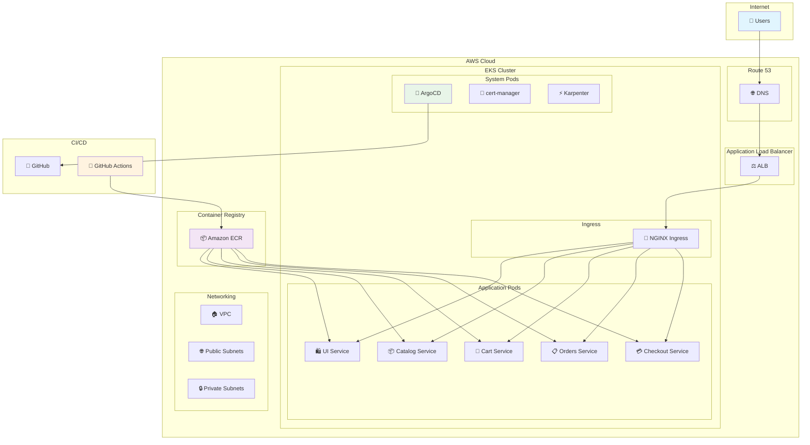
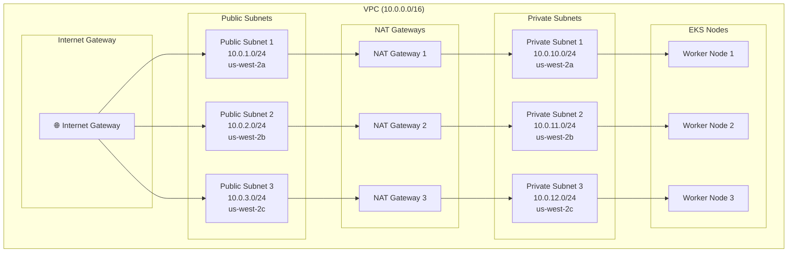
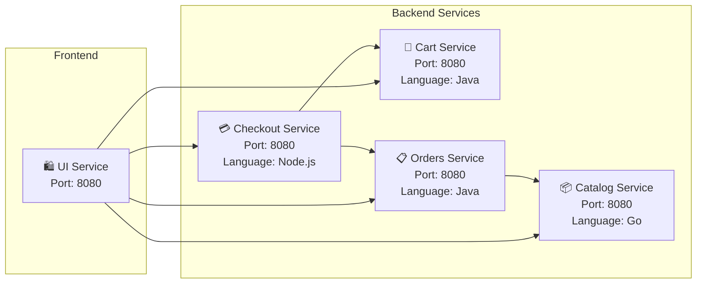
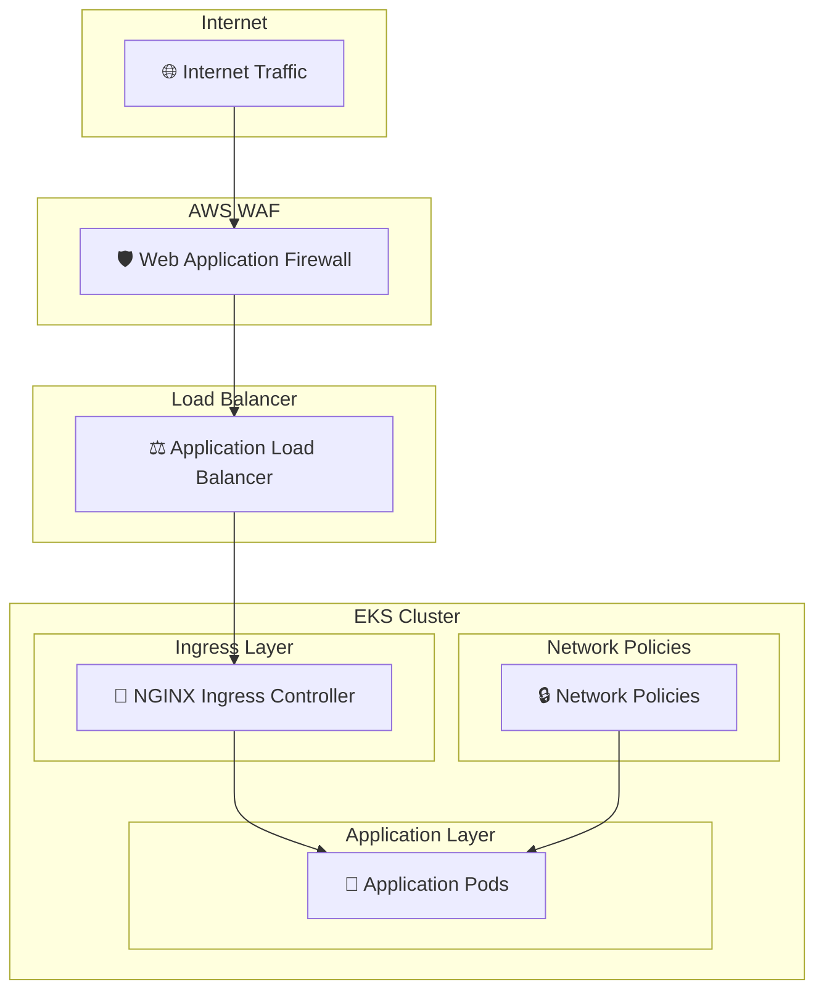
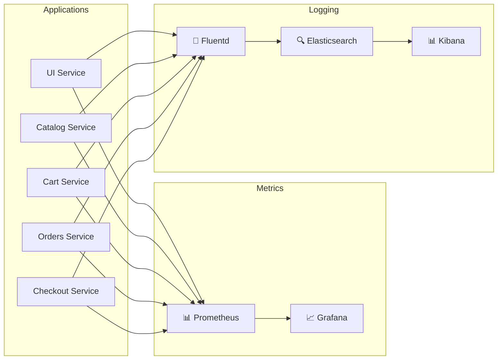

# 🏗️ Architecture Documentation

## System Architecture

### High-Level Architecture



### Network Architecture



### Service Communication



## Component Details

### Infrastructure Components

| Component | Purpose | Configuration |
|-----------|---------|---------------|
| **VPC** | Network isolation | CIDR: 10.0.0.0/16 |
| **EKS Cluster** | Kubernetes orchestration | Version: 1.33 |
| **Karpenter** | Node auto-scaling | Instance types: c7i-flex.large |
| **ECR** | Container registry | Scan on push enabled |
| **ALB** | Load balancing | Internet-facing |

### Application Services

#### UI Service (Java/Spring Boot)
- **Purpose**: Frontend web interface
- **Port**: 8080
- **Health Check**: `/actuator/health/readiness`
- **Resources**: 512Mi memory, 128m CPU
- **Replicas**: 1 (configurable)

#### Catalog Service (Go)
- **Purpose**: Product catalog management
- **Port**: 8080
- **Database**: SQLite (configurable to MySQL)
- **Resources**: 256Mi memory, 128m CPU
- **Replicas**: 1 (configurable)

#### Cart Service (Java/Spring Boot)
- **Purpose**: Shopping cart functionality
- **Port**: 8080
- **Storage**: In-memory (configurable to Redis)
- **Resources**: 512Mi memory, 128m CPU
- **Replicas**: 1 (configurable)

#### Orders Service (Java/Spring Boot)
- **Purpose**: Order processing and management
- **Port**: 8080
- **Database**: H2 (configurable to PostgreSQL)
- **Resources**: 512Mi memory, 128m CPU
- **Replicas**: 1 (configurable)

#### Checkout Service (Node.js)
- **Purpose**: Payment processing
- **Port**: 8080
- **Framework**: Express.js
- **Resources**: 256Mi memory, 128m CPU
- **Replicas**: 1 (configurable)

### GitOps Components

#### ArgoCD
- **Purpose**: GitOps continuous deployment
- **Namespace**: argocd
- **UI Port**: 443 (HTTPS)
- **Sync Policy**: Automated with self-heal

#### GitHub Actions
- **Triggers**: Push to main branch
- **Jobs**: Build, test, push images, update charts
- **Secrets**: AWS credentials, GitHub token

## Security Architecture

### Network Security



### RBAC Configuration

```yaml
# Service Account Permissions
apiVersion: v1
kind: ServiceAccount
metadata:
  name: retail-store-ui
  namespace: retail-store
---
apiVersion: rbac.authorization.k8s.io/v1
kind: Role
metadata:
  name: retail-store-ui
  namespace: retail-store
rules:
- apiGroups: [""]
  resources: ["configmaps", "secrets"]
  verbs: ["get", "list"]
```

### Security Best Practices

1. **Pod Security Standards**: Restricted security context
2. **Image Scanning**: ECR vulnerability scanning
3. **Network Policies**: Deny-all default with explicit allows
4. **TLS Encryption**: End-to-end encryption with cert-manager
5. **Secrets Management**: Kubernetes secrets with encryption at rest
6. **RBAC**: Least privilege access control

## Scalability and Performance

### Auto-scaling Configuration

#### Horizontal Pod Autoscaler (HPA)
```yaml
apiVersion: autoscaling/v2
kind: HorizontalPodAutoscaler
metadata:
  name: retail-store-ui-hpa
spec:
  scaleTargetRef:
    apiVersion: apps/v1
    kind: Deployment
    name: retail-store-ui
  minReplicas: 2
  maxReplicas: 10
  metrics:
  - type: Resource
    resource:
      name: cpu
      target:
        type: Utilization
        averageUtilization: 70
```

#### Karpenter Node Scaling
```yaml
apiVersion: karpenter.sh/v1beta1
kind: NodePool
metadata:
  name: general-purpose
spec:
  template:
    spec:
      requirements:
        - key: kubernetes.io/arch
          operator: In
          values: ["amd64"]
        - key: karpenter.sh/capacity-type
          operator: In
          values: ["on-demand"]
      nodeClassRef:
        apiVersion: karpenter.k8s.aws/v1beta1
        kind: EC2NodeClass
        name: default
  disruption:
    consolidationPolicy: WhenUnderutilized
    consolidateAfter: 30s
```

### Performance Optimization

1. **Resource Requests/Limits**: Properly sized containers
2. **Node Affinity**: Optimal pod placement
3. **Readiness Probes**: Traffic routing to healthy pods
4. **Connection Pooling**: Efficient database connections
5. **Caching**: Redis for session and data caching

## Monitoring and Observability

### Metrics Collection



### Health Checks

Each service implements health check endpoints:

- **Readiness Probe**: `/actuator/health/readiness` (Java) or `/health` (Node.js/Go)
- **Liveness Probe**: `/actuator/health/liveness` (Java) or `/health` (Node.js/Go)
- **Metrics Endpoint**: `/actuator/prometheus` (Java) or `/metrics` (Node.js/Go)

## Disaster Recovery

### Backup Strategy

1. **Configuration Backup**: Git repository serves as source of truth
2. **Data Backup**: Database snapshots (when using persistent storage)
3. **Image Backup**: ECR cross-region replication
4. **Infrastructure Backup**: OpenTofu state files in S3

### Recovery Procedures

1. **Infrastructure Recovery**: Re-run OpenTofu deployment
2. **Application Recovery**: ArgoCD automatic sync from Git
3. **Data Recovery**: Restore from database snapshots
4. **Cross-Region Failover**: Deploy to secondary region

## Cost Optimization

### Resource Optimization

1. **Right-sizing**: Appropriate resource requests/limits
2. **Auto-scaling**: Scale down during low usage
3. **Spot Instances**: Use for non-critical workloads
4. **Reserved Instances**: For predictable workloads
5. **Image Lifecycle**: Automatic cleanup of old images

### Cost Monitoring

```bash
# Monitor resource usage
kubectl top nodes
kubectl top pods --all-namespaces

# Estimate costs
aws ce get-cost-and-usage --time-period Start=2024-01-01,End=2024-01-31 --granularity MONTHLY --metrics BlendedCost
```

## Future Enhancements

### Planned Features

1. **Service Mesh**: Istio for advanced traffic management
2. **Observability**: Complete monitoring stack with Prometheus/Grafana
3. **Multi-Region**: Cross-region deployment for high availability
4. **Database**: Persistent storage with RDS/Aurora
5. **Caching**: Redis cluster for improved performance
6. **CI/CD**: Advanced deployment strategies (blue-green, canary)

### Scalability Roadmap

1. **Microservices**: Further decomposition of services
2. **Event-Driven**: Asynchronous communication with message queues
3. **API Gateway**: Centralized API management
4. **CDN**: CloudFront for static content delivery
5. **Global Load Balancing**: Route 53 health checks and failover